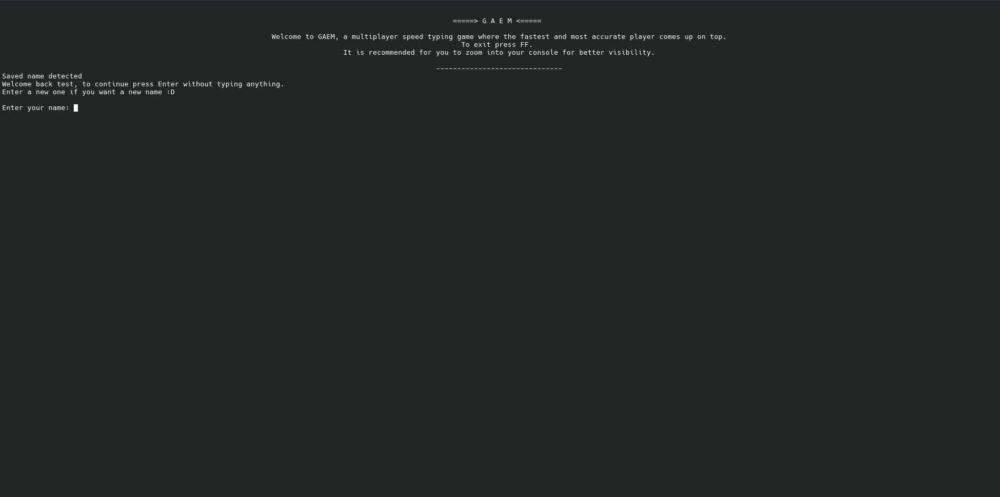

<h1 align="center">GAEM</h1>

GAEM is a multiplayer speed-typing game made for a foundation level programing course. [GitHub link](https://github.com/Soo0707/CSP-Game-Project)

---
# Instructions
1. Start server.py in a console window.
1. In another console instance, start client.py and connect using address `localhost` and port `1234` unless specified otherwise.

You might need to tweek with `MAX_CONNECTIONS` in server.py depending on the number of desired players.

---
# server.py
## Constant configuration variables

### MAX_CONNECTIONS
`MAX_CONNECTIONS` specifies the maximum number of clients allowed to connect to the server at a given instance. Note that the server will keep all players waiting until MAX_CONNECTIONS is reached. Set to 1 to run single-player. Defaults to 1. 

### PORT
`PORT` specifies the port number the server binds to. Defaults to 1234. 

### DICTIONARY_PATH
`DICTIONARY_PATH` specifies the path to a dictionary file for random access to generate a word list from. 

### WORD_SET_LENGTH
`WORD_SET_LENGTH` specifies the length of the word list that is sent to clients. Defaults to 10. 

## Dictionary

The server exits in case `WORD_SET_LENGTH` exceeds the number of lines of the dictonary file specified in `DICTIONARY_PATH` but does not take duplicates into consideration. It also expects words in the form `[WORD]\n`.

---

# Protocol

Keywords that the client and server can use to communicate, we just have to compare the string we receive to determine what we send, subject to change, in plain-text 
NOTE: we're sending and receiving the python objects using pickle.dumps() and pickle.loads()

### START
Server sends START to start a round

### VERIFY
Client sends VERIFY and server responds with a magic string to ensure we don't connect to a random server

### SET_NAME [NAME(str)]
Client sends a username to the server to see if it's available, if available continue if not we send NAME_UNAVAILABLE, sent in two parts so we don't have to use regex to match strings

### NAME_UNAVAILABLE
Server sends to client if username is already taken, client must prompt the user again for another username

### NAME_OK
Server sends to clients if name is accepted

### CLIENT_PACKET [TIME_DELTA(int)]
Client sends this to the server every time a player submits a word,
TIME_DELTA is the difference between when the player receives the prompt and when they submit in milliseconds, if TIME_DELTA == -1, the player broke combo.
Sent in two parts, every time the player submits

### FF
Client sends to server if player drops out of the game

### REQUEST_WORD_PAYLOAD
The client sends REQUEST_WORD_PAYLOAD and the server will respond with a word payload in the form of a python list object

### REQUEST_LEADERBOARD
Client sends to the server to get the current leaderboard after the game ends and disconnects the client, the client should be expecting the leaderboard before disconnecting.
The server will respond by sending a python list object with the names and scores of people at the top, if the client is not in the top 5, their position would be sent as the 6th element in the list.

### READY
Client sends to the server after username is set to show that it's waiting. Sending START will start the client.

---
# Credits
default.txt is a dictionary file obtained from [here](https://github.com/first20hours/google-10000-english).
